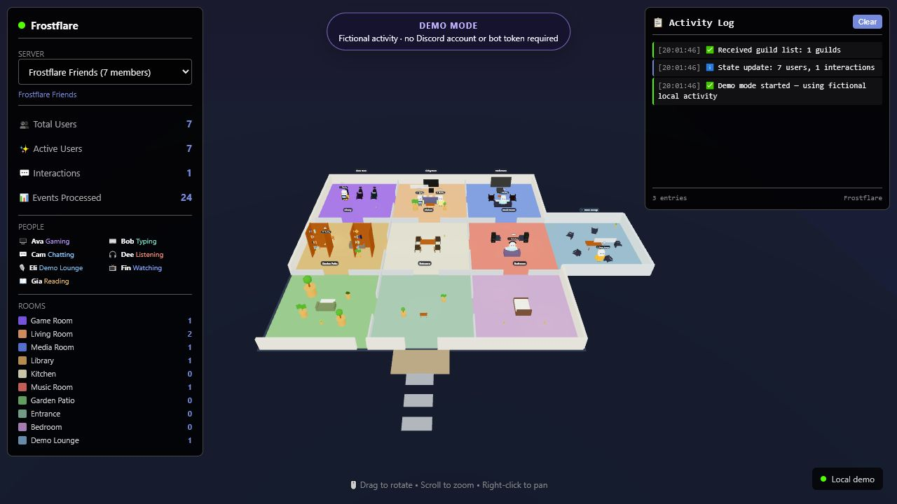

# Frostflare

Turn a Discord community into a living 3D house. Frostflare maps messages, voice activity, games, music, and presence into rooms, avatars, conversations, and movement—locally, on your own computer.



> No Discord account is needed for the demo. The sample people and activity are fictional and stay in your browser.

**[Open the live Frostflare demo](https://frozenscorch.github.io/frostflare/)**

## Try it in two minutes

You need a supported [Node.js](https://nodejs.org/) release: 20.19+, 22.13+, or 24+.

```bash
git clone https://github.com/FrozenScorch/frostflare.git
cd frostflare
npm run setup
npm run demo
```

Open <http://localhost:8500>. Drag to rotate, scroll to zoom, and right-click to pan. Demo activity refreshes every few seconds so you can see conversations, typing, games, music, and a voice room without creating a bot.

## What you are looking at

- Each Discord member becomes a small avatar.
- Activity chooses the room: games go to the game room, music to the music room, and so on.
- Voice channels appear as rooms when people join them.
- Messages can create speech bubbles and lightweight conversation signals.
- The activity log shows when the browser receives new state.

The demo uses the same React and Three.js presentation path as a live server; it only replaces the WebSocket input with fictional local fixtures.

## Connect your own Discord server

Frostflare is local-first. The bot, optional model, WebSocket server, and browser can all run on one machine.

1. Follow [Discord setup](docs/DISCORD_SETUP.md) to create an app, enable the three required gateway intents, and install it in a server you control.
2. Copy `backend/.env.example` to `backend/.env` and set `DISCORD_TOKEN`.
3. Start the backend:

   ```bash
   npm run dev:backend
   ```

4. In another terminal, start the live frontend:

   ```bash
   npm run dev:frontend
   ```

5. Open <http://localhost:8500> and generate a little activity in Discord.

Windows PowerShell users can copy the environment file with:

```powershell
Copy-Item backend/.env.example backend/.env
```

The LLM is optional. Without it, Frostflare uses deterministic rules for classification and interaction detection.

## Architecture

```text
Discord Gateway
  -> 1 second event batches
  -> LangGraph: ingest -> classify -> spatial analysis -> map location
               -> interactions -> animation -> broadcast
  -> local WebSocket server
  -> React + Three.js browser
```

The backend is TypeScript/Node.js with Discord.js and LangGraph. The frontend is React, Vite, React Three Fiber, and Three.js. An optional OpenAI-compatible llama.cpp endpoint can improve classification and spatial reasoning.

## Documentation

| Guide | Use it when you want to… |
| --- | --- |
| [Discord setup](docs/DISCORD_SETUP.md) | Create and safely install the bot |
| [Cookbook](docs/COOKBOOK.md) | Run the demo, connect live data, inspect the stream, or add behavior |
| [WebSocket API](docs/API.md) | Build a client or understand every wire message |
| [Architecture](docs/ARCHITECTURE.md) | Follow an event through the full pipeline |
| [Troubleshooting](docs/TROUBLESHOOTING.md) | Fix blank scenes, connection loops, intents, or llama.cpp issues |
| [Contributing](CONTRIBUTING.md) | Make and verify a change |

## Configuration

Backend settings live in `backend/.env`:

| Variable | Default | Purpose |
| --- | --- | --- |
| `DISCORD_TOKEN` | required | Discord bot token; never commit it |
| `LLAMA_ENDPOINT` | `http://localhost:1234` | Optional OpenAI-compatible llama.cpp endpoint |
| `WS_PORT` | `8000` | Local WebSocket port |
| `WS_HOST` | `127.0.0.1` | Bind address; loopback is the safe default |

Frontend settings can live in `frontend/.env.local`:

| Variable | Default | Purpose |
| --- | --- | --- |
| `VITE_WS_URL` | `ws://localhost:8000` | Live backend URL |
| `VITE_DEMO_MODE` | `false` | Use fictional browser-only fixtures |

Prefer `npm run demo` over editing `VITE_DEMO_MODE`; the script loads the checked-in `.env.demo` configuration explicitly.

## Privacy and safety

Frostflare processes Discord presence and message text in memory. It is intended for servers where participants understand that activity is being visualized.

- Keep `WS_HOST=127.0.0.1` unless you understand the network consequences.
- The WebSocket API has no authentication or TLS; never expose it directly to the public internet.
- Use a VPN or authenticated TLS reverse proxy for remote access.
- Never commit bot tokens, `.env` files, real Discord exports, or screenshots containing private names/messages.
- The demo contains only fictional data and makes no Discord connection.

See [SECURITY.md](SECURITY.md) for vulnerability reporting.

## Verify a checkout

```bash
npm run setup
npm run check
```

CI runs the same documentation checks, smoke tests, live/demo builds, type checks, and production dependency audits on pull requests.

## Project status

Frostflare is an experimental personal project and local visualization—not a hosted analytics service or employee-monitoring tool. Expect the protocol and room behaviors to evolve before a stable 1.0 API.

## License

MIT. See [LICENSE](LICENSE).
