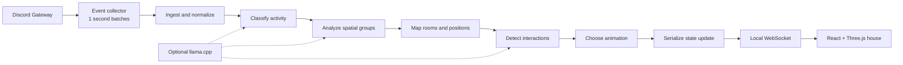

# Architecture

Frostflare is a local event-processing pipeline with a 3D projection at the edge.

## Runtime pieces

### Discord collector

`backend/src/discord/events.ts` subscribes to Discord.js, reduces each event to the fields Frostflare needs, and flushes batches at most once per second. Bot and direct-message events are excluded from message and typing handlers.

### LangGraph pipeline

`backend/src/agent/graph.ts` owns pipeline order and persistent user, relationship, interaction, and spatial state. The ingest node turns event batches into canonical users. Later nodes progressively decide activity, room, position, social interaction, and animation.

LLM calls are optional. Each LLM-assisted stage has a deterministic fallback so the graph can run offline.

### WebSocket boundary

The broadcast node converts internal maps, dates, and `userId` fields to JSON wire types. The server caches the latest `state_update`, which makes a new browser useful immediately after connecting.

See [API.md](API.md) for the public wire shape. Internal graph state is not a public API.

### Browser

`frontend/src/hooks/useWebSocket.ts` owns transport state. `App.tsx` chooses the guild and derives static plus dynamic voice rooms. `House3D.tsx` renders rooms and avatars and interpolates each avatar toward `targetPosition`.

Demo mode replaces only the transport input with `frontend/src/data/demo.ts`; the rest of the browser path is the same.

## Extension boundaries

- New Discord input: `backend/src/discord/events.ts`
- New canonical behavior: `backend/src/agent/nodes/`
- Graph ordering/reducers: `backend/src/agent/graph.ts` and `state.ts`
- Public serialization: `backend/src/agent/nodes/broadcast.ts`
- Alternative browser/backend transport: `backend/src/websocket/server.ts`
- New visual room/furniture: `frontend/src/components/`

Before adding a field, decide whether it is transient event input, persistent internal state, or public wire state. Keeping those layers separate prevents Discord.js objects or private data from leaking into clients.
